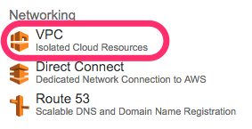
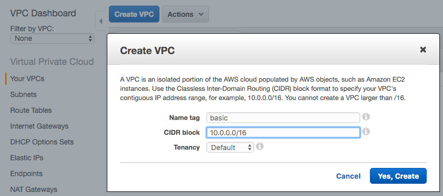
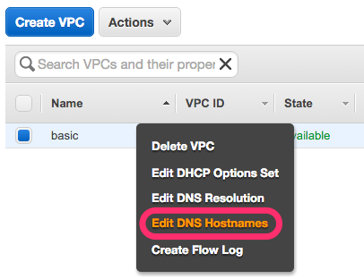
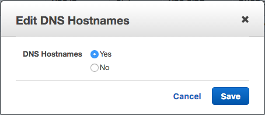

# VPCを作る

AWS Management Consoleにて、VPCを選択しよう。

Create VPCボタンを押して、VPCを作成しよう。
ここでの名前"bacic"とする。

Private DNS、つまるところAWSで作成した他のホストについてから
ホスト名を引けるようにするため、Private DNSを有効にする。

作成したVPCを一覧より選択し、右クリック(かそれに相当する行為)で
"Edit DNS Hostnames"オプションを呼びだそう。

"Edit DNS Hostanames"の"DNS Hostnames"が
"YES"と設定し保存すればOKだ。

