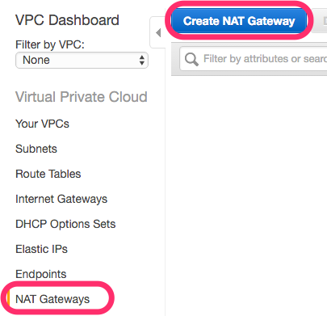
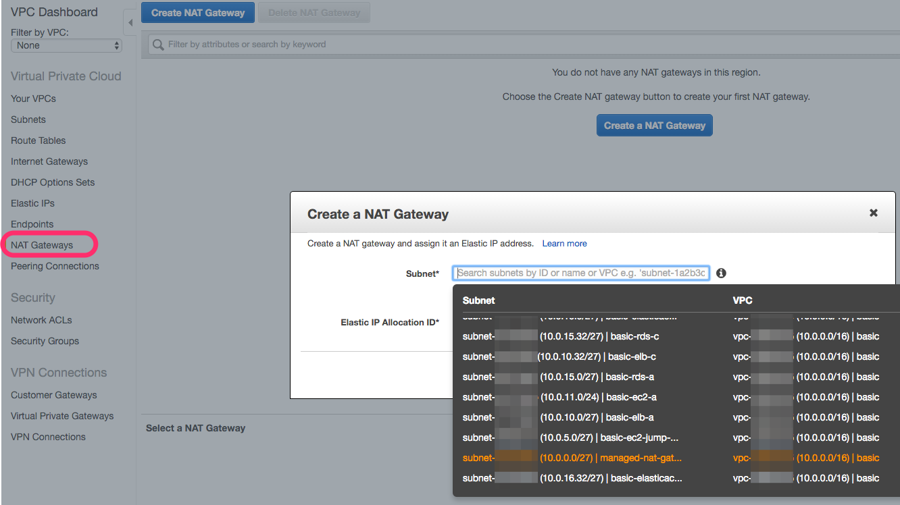
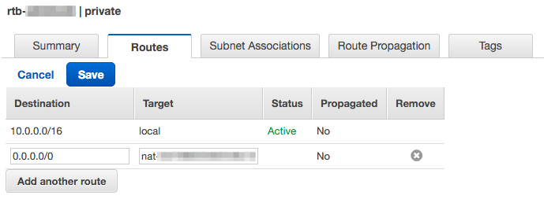
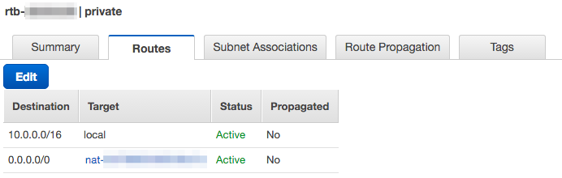

# Managed NAT Gatewayを作る

Managed NAT Gatewayについては他のページで軽く紹介したが、
2015年12月からAWSにて利用が可能になったNATを気軽に作成できるサービス。
今までは提供されてるNAT用のAMIか、
[VyOS](http://vyos.net/wiki/Main_Page)か何かでNAT用インスタンスを用意し、
[ENI](http://docs.aws.amazon.com/ja_jp/AWSEC2/latest/UserGuide/using-eni.html)をアタッチしてあげなければいけなかった。
Managed NAT Gatewayがリリースされ、利用できるようになってから
NATについて深く考えなくてよくなった。

# さて作ろう

と、まえがきはこのぐらいにして、実際に作ろう。
[【新機能】マネージドNATゲートウェイが利用可能に](http://aws.typepad.com/aws_japan/2015/12/managednat.html)に載っているやり方そのままだが。
VPC Dashboardより、NAT Gatewaysを選択し、
"Create NAT Gateway"ボタンを押す。

以前作成していたSubnet、managed-nat-gateway用のSubnetを選択し、
EIPについて"Create New EIP"ボタンを押して作成する

内容に問題がないのであれば、"Create a NAT Gateway"ボタンを押して作成しよう。

# "private" Route tableのRoutesにManaged Nat Gatewayを設定する

"private" Route tableが利用するためのNATインスタンスを
先ほど作成した。"private" Route TableのRoutesに設定を行おう。

これでManaged NAT Gatewayの設定は終わり。気軽だ。
