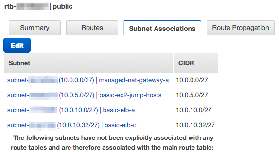

# Subnetとルーティングテーブルを結びつける

作成したSubnetとルーティングテーブルを結びつけて
いよいよネットワークを構築していく。

[ルーティングテーブル is 何という人はこちらを参考](http://docs.aws.amazon.com/ja_jp/AmazonVPC/latest/UserGuide/VPC_Route_Tables.html)のこと。

# Internet Gatewayを作る

Internet Gatewayを作成し、basic VPCにattachをする。
Internet Gatewayを作成することにより、VPC内のホストから
インターネット側への通信が可能になる。

- [詳しくはこちらを参考](http://docs.aws.amazon.com/ja_jp/AmazonVPC/latest/UserGuide/VPC_Internet_Gateway.html)

## "basic"という名のInternet Gatewayを作成する。

# ルーティングテーブルを作成する

## Route Table

public用とpvitate用、2つを作成する。

- publicは、インターネットとのやり取りを行うためのもの。
- privateは、サービス内での通信を行うためのもの。

## Route Tableを作成する

Route Tableを作成し、
作成した"bacic" Internet GatewayをRoutesと結びつける。

public, privateについてそれぞれ作成する。

# "public" Route Table

## "public" Route Tableに対するInternet Gatewayの設定

"public" Route Tableに対してInternet Gatewayの設定を行う。

これにより、"public" Route Tableに割り当てられた
EC2インスタンスがインターネットに出られるようになった。

## "public" Route TableのSubnet Associationsの設定

SubnetがどのRoute Tableに設定されているのか、について
Subnet Associationsの設定によって行う。

# "private" Route Table

## "private" Route Tableに対するInternet Gatewayの設定

"private" Route Tableに対してInternet Gatewayの設定を行う。

## "private" Route TablesのSubnet Associationsの設定

AWS内でのみ通信のやり取りを行うホスト、サービス(ElastiCacheなど)の
Subnetの設定を行う

