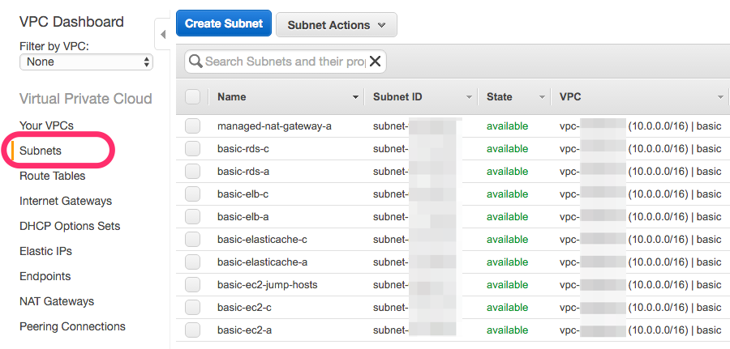

# VPCで利用するためのSubnetを切る

Subnetを設定することで、AというEC2インスタンスを
XというSubnetに属させ、Webサーバとして利用し、
public、表世界からのアクセスを許可させるものとする
とか、ネットワーク構成の単位として扱えば良い。
通常のネットワーク構成を作る際に設定する
サブネットマスクと同じと考える。

Subnetについて詳しく知りたい場合は、
[こちらを参考](http://docs.aws.amazon.com/ja_jp/AmazonVPC/latest/UserGuide/VPC_Subnets.html)のこと。

# 今回の例で切っているSubnetの注意点

1000台以上のホストを同じSubnetに属させる...とかは考えず、
ミニマムな構成でSubnetを切っている。
そのため、本当に使いたいネットワーク構成とは
かけ離れたケチケチなSubnet構成になっている。注意。

# 各Subnetを切っていく

## 作成しようとしているSubnet

テーブル構造にて示す。

|Subnet|役割|Availability Zone|
|:----:|:---|:----------------|
|10.0.0.0/27|Managed NAT Gateway|ap-northeast-1a|
|10.0.5.0/27|EC2(踏み台)|ap-northeast-1a|
|10.0.10.0/27|ELB|ap-northeast-1a|
|10.0.10.32/27|ELB|ap-northeast-1c|
|10.0.11.0/24|EC2|ap-northeast-1a|
|10.0.12.0/24|EC2|ap-northeast-1c|
|10.0.15.0/27|RDS|ap-northeast-1a|
|10.0.15.32/27|RDS|ap-northeast-1c|
|10.0.16.0/27|ElastiCache|ap-northeast-1a|
|10.0.16.32/27|ElastiCache|ap-northeast-1c|

# Managed NAT Gatewayとは

以前はNATについては、EC2インスタンスから作成しなければ
ならなかったが、
[Managed NAT Gateway](http://aws.typepad.com/aws_japan/2015/12/managednat.html)というサービスが
AWSから発表されたので、それを利用してみる。

* なお、NATを自前で作りたい！という場合は
  [提供されているAMI](http://docs.aws.amazon.com/ja_jp/AmazonVPC/latest/UserGuide/VPC_NAT_Instance.html)から作成するか、[VyOS](http://vyos.net/wiki/Main_Page)を利用するか
  某を利用して頑張って構築すること(そこまで大変ではないけれど)。

# 作成したSubnetたち

AWS Management Console > VPC Dashboard > Subnetsより、
SubnetをUIから作ることができる。

作成し終えたSubnetのスクショは以下。

## Subnetをどうつかうか

についての図は以下。
こんな感じで各ホスト・サービスを設定・繋いでいく。

# CIDRの広さ

/27で分けているのはあくまでもテスト。
20台にも満たないホスト数を管理しつづける、
作成するということはサービスを維持するときにはありえないので、
適宜/24か/23で切ること。
Subnetについては予約済みのアドレスが既に含まれていて、
AWSの場合すでに5つが予約済みとなる。
そのため/27がAWSで利用できるSubnetのCIDRでの最低数となっていることが多い(全てかどうかは未確認)

- [詳しくはこちらを参考](http://docs.aws.amazon.com/ja_jp/AmazonVPC/latest/UserGuide/VPC_Subnets.html#SubnetSize)のこと。
