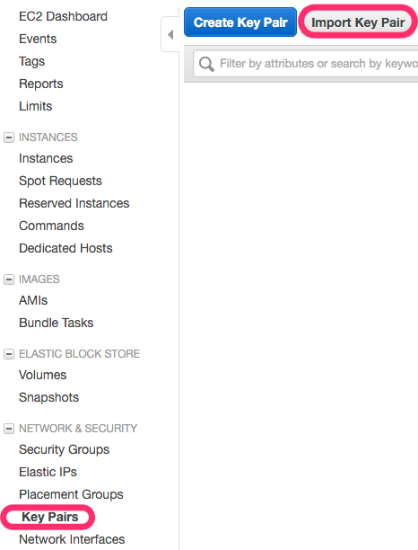
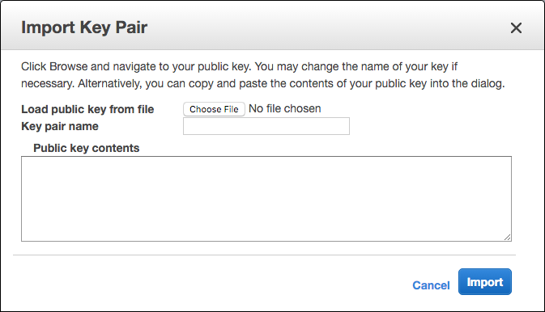
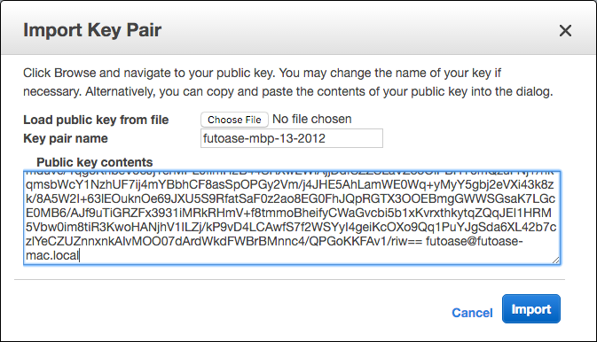

# Keypairの登録

EC2インスタンスを作成するとき、
Amazon AMIであればec2_user、
Ubuntuであればubuntuのユーザに対し
Keypairを登録し、自分のホスト(Mac Bookとか)から
ssh経由でログインできるようにできる

# どこから登録するか

AWS Management Consoleの
EC2 Dashboardから、NETWORK & SECURITYから、"Key Pairs"を選んで登録する
"Import Key Pair"を選択して既存のSSH Keyを登録しよう
(皆ssh keyを作成している前提)

[RSA Keyしかインポートできないので注意](http://docs.aws.amazon.com/ja_jp/AWSEC2/latest/UserGuide/ec2-key-pairs.html#how-to-generate-your-own-key-and-import-it-to-aws)しよう。(2016年3月現在)

