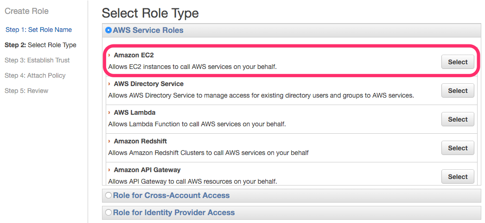

# EC2インスタンスの作成

Subnetで設定した通り、
ap-northeast-1aとap-northeast-1cそれぞれに
EC2インスタンスを作成する。

# Ubuntu 14.04 AMIから作成

AWS EC2用のAMIにはUbuntu 14.04用のAMIがある。
それを選択し、インスタンスを作成しよう。

Ubuntu 14.04のAMIを選択する。

## t2.nanoなインスタンスを作成していく

最近利用できるようになった[t2.nano](http://aws.typepad.com/aws_japan/2015/12/ec2-update-t2-nano-instances-now-available.html)という
サイズのインスタンスを利用する。

### 【その前に】 EC2インスタンス作成前にIAMを作成する

EC2インスタンスを作成する前に、IAM Roleを作成する。
作るときに指定しても良いが。IAM Roleを作成し、
EC2インスタンスに付与しておけば後々で通信を絞ることも可能になる。
(2016年3月現在勤めている会社の若手に教えてもらった)

Identiti & Access Managementを選択し、Roleを作成する。

"Create New Role"を押して、Roleを作成していく。

細かい利用用途が決まってないので、
"AdministratorAccess"ルールを選択する。

これでEC2インスタンスにあてがうIAM Roleは完成。

## EC2インスタンスにIAM Roleをあてがう

EC2インスタンス作成時に先ほど作成したIAM Roleをあてがう。

## Storage

Storageについては仮なので、8GBを適当に割り当てる。
本当にサービス向けに利用したいなら20GB以上は割り当てておくと良いと思う。
ログとかあるし。

## Tag

[capistrano ec2 gem](https://github.com/forward3d/cap-ec2)では、
"Role", "Stage", "Project"のEC2 tagを利用するようになっている。
今後capistrano ec2 gemを利用しない...となったとしても
tagにより細かくEC2インスタンスを分けておけるのは後々便利だ。
(API呼び出しやフィルタリングなど)

## Security Group

Security Groupの作成で作成しておいた
"basic-service"と"basic-public"、2つのSecurity Groupを設定する。

## Launch

"Review and Launch"ボタンを押して、作成されるインスタンスの内容(ENI, Tag, Security Groupなど)に問題がなければ、"Launch"ボタンを押す。

## key pairの作成

"Launch"ボタンを押したあと、keypairの選択が求められる。予めImportしておいたkey pairを選択し、I acknowledge...のチェックを入れ(利用するキーが間違いないかのチェック)、"Launch Instances"ボタンを押す。

これでEC2インスタンスが作成される

# EC2インスタンスの作成

先ほどのインスタンスともう一つ、Availability Zoneの未選択(今回の場合であればA)のインスタンスを作成する。ELBによるバランシングで異なるAvailability Zoneのインスタンスを選択させることで可用性を高めるためだ。
