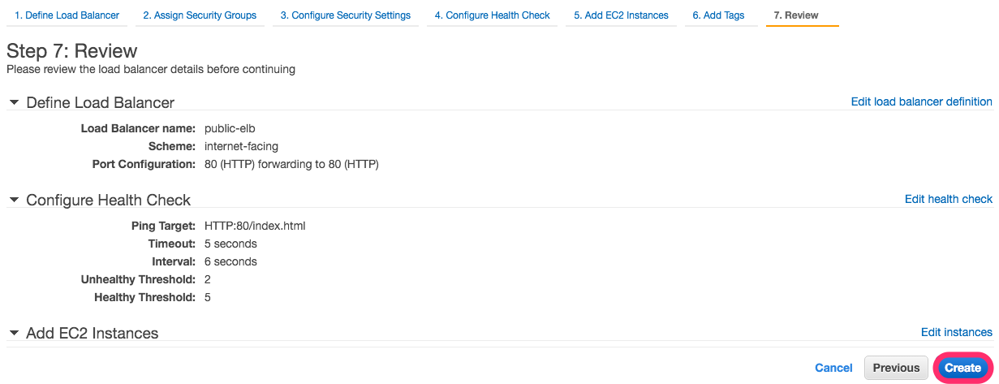

# ELB

作成したEC2インスタンスをぶら下げるために
ELBを作成する。
ELBについて何か？を知りたければ以下のドキュメントを参考のこと。

[Elastic Load Balancing](https://aws.amazon.com/jp/elasticloadbalancing/)
# ELBの作成

EC2 Dashboardより、"Load Balancers"を選択し、
"Create Load Balancer"ボタンを押す。

# ELB名、通すプロトコル

ELB名と疎通を許可するプロトコルを設定する。
ELBからec2-web-0[12]に対して、
80 <-> 80の疎通を外部ネットワークからのアクセスを
許可するようにする。

nginxなどをroot権限で動かしていない場合、
80 <-> 8080 など、well-knownポート外のものを選択する。
通常はそうするが今回は端折る。

# Subnetの選択

同じ画面で、Subnetの選択ができる。
ELBはec2-web-0[12]が所属している
Subnetを利用できるように設定する。

# Security Groupの設定

Security Groupについては、すでに作成した
"basic-service"と"basic-elb"を選択する。

# Health Checkの設定

Health Checkの設定に入る。

設定について7つの要素が必要となる

|用語|内容|
|:---|:---|
|Ping Protocol|ELBにつながっているEC2インスタンスのHealth Checkに利用するプロトコル|
|Ping Port|プロトコルが利用するポート番号|
|Ping Path|Health Checkが確認しに行くPath|
|Response Timeout|Health Checkが有効とされるまで許されるレスポンスの長さ|
|Health Check Interval|Health Checkが行われるタイミング|
|Unhealthy Threshold|Health Checkにて死亡と判断されてしまう回数|
|Healthy Threshold|Health Checkにて生存と判断されるための回数|

こんなところ。例では以下のスクショのようにした。

# ELBにぶら下げるEC2インスタンスの選択

については、Subnetをきちんと選択していれば
きちんとしたEC2インスタンスが出てくる。
例では、"ec2-web-01", "ec2-web-02"をぶら下げるようにしている

# Tagの設定

ELBの名前を設定しておこう。

# ELBの立ち上げ

"Review and Create"ボタンを押して、
内容に問題がなければ"Create"ボタンを押して作成してしまおう。

