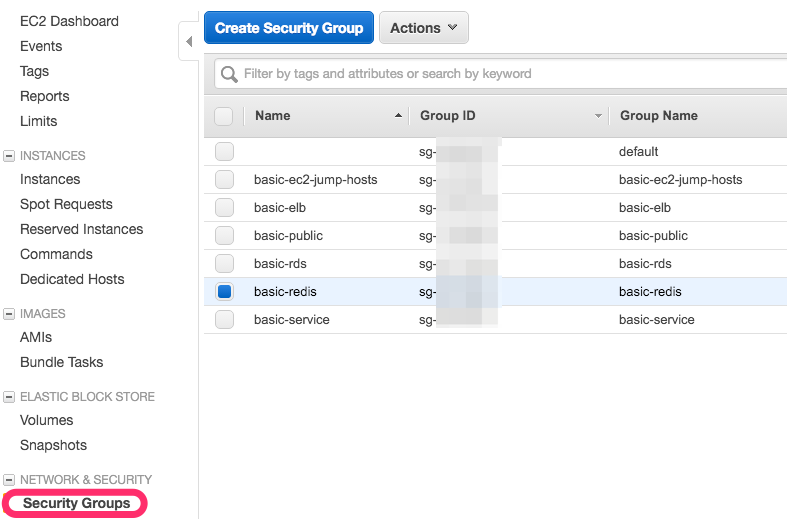
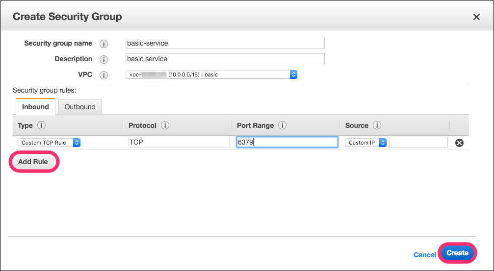

# Security Groupを作成する

EC2インスタンス向けにSecurity Groupの作成を行う。
Security Groupについては以下のドキュメントを参考のこと

[Linux インスタンスの Amazon EC2 セキュリティグループ](http://docs.aws.amazon.com/ja_jp/AWSEC2/latest/UserGuide/using-network-security.html)

# 各SecurityGroup

作成するSecurity Groupは以下のものとする

|Security Group|利用目的|
|:--------------|:-------|
|basic-service|基本的な疎通設定(共通)|
|basic-ec2-jump-hosts|踏み台用サーバ|
|basic-elb|ELB向け|
|basic-public|サービス提供サーバ|
|basic-rds|RDS向け|
|basic-redis|ElastiCache(Redis)向け|

## 全体をテーブルに起こす

各Security Groupの役割については、
別途各ホスト、サービス(RDS, ElastiCache)作成時に引用する。

### basic-service

- inbound

|Type|Protocol|Port Range|Source|
|:---|:-------|:---------|:-----|
|HTTP|TCP|80|basic-elb|
|All traffic|All|All|basic-public|
|All traffic|All|All|basic-redis|
|All traffic|All|All|basic-service|
|All traffic|All|All|basic-rds|
|SSH|TCP|22|basic-ec2-jump-hosts|

- outbound

|Type|Protocol|Port Range|Source|
|:---|:-------|:---------|:-----|
|All traffic|All|All|basic-public|
|All traffic|All|All|basic-rds|
|All traffic|All|All|basic-service|
|Custom TCP Rule|TCP|6379|basic-redis|

### basic-ec2-jump-hosts

- inbound

注意点として、出来る限りCIDRによってIPアドレスを指定できるといいと思う。
鍵を使って認証する、というのでもいいけれど。

|Type|Protocol|Port Range|Source|
|:---|:-------|:---------|:-----|
|SSH|TCP|22|0.0.0.0/0|

- outbound

|Type|Protocol|Port Range|Source|
|:---|:-------|:---------|:-----|
|All traffic|All|All|0.0.0.0/0|

### basic-elb

- inbound

|Type|Protocol|Port Range|Source|
|:---|:-------|:---------|:-----|
|HTTP|TCP|80|0.0.0.0/0|
|All traffic|All|All|basic-service|

- outbound

|Type|Protocol|Port Range|Source|
|:---|:-------|:---------|:-----|
|All traffic|All|All|0.0.0.0/0|

### basic-public

- inbound

|Type|Protocol|Port Range|Source|
|:---|:-------|:---------|:-----|
|Custom TCP Rule|TCP|8080|basic-elb|

- outbound

|Type|Protocol|Port Range|Source|
|:---|:-------|:---------|:-----|
|HTTP|TCP|80|0.0.0.0/0|
|Custom UDP Route|123|0.0.0.0/0|
|HTTPS|TCP|443|0.0.0.0/0|

### basic-rds

- inbound

5432 portはPostgreSQL用

|Type|Protocol|Port Range|Source|
|:---|:-------|:---------|:-----|
|MYSQL/Aurora|TCP|5432|basic-service|

- outbound

|Type|Protocol|Port Range|Source|
|:---|:-------|:---------|:-----|
|All traffic|All|All|0.0.0.0/0|

### basic-redis

- inbound

|Type|Protocol|Port Range|Source|
|:---|:-------|:---------|:-----|
|All traffic|All|All|basic-redis|
|Custom TCP Rule|TCP|6379|basic-service|

- outbound

|Type|Protocol|Port Range|Source|
|:---|:-------|:---------|:-----|
|All traffic|All|All|basic-redis|
|All traffic|All|All|basic-service|

# Security Groupの作成

作成を行うために、
AWS Management Console > EC2 Dashboard > "Security Group"を選択する

"Create Security Group"ボタンを押し、Modalを出す。

## Create Security GroupのModal

"Inbound", "Outbound"各タブを開き、
"Add Rule"ボタンを押し、設定が終わったら"Create"ボタンを押す。

Security Groupの作成は設計と、実際に作成する作業を
こなすだけで良い。

