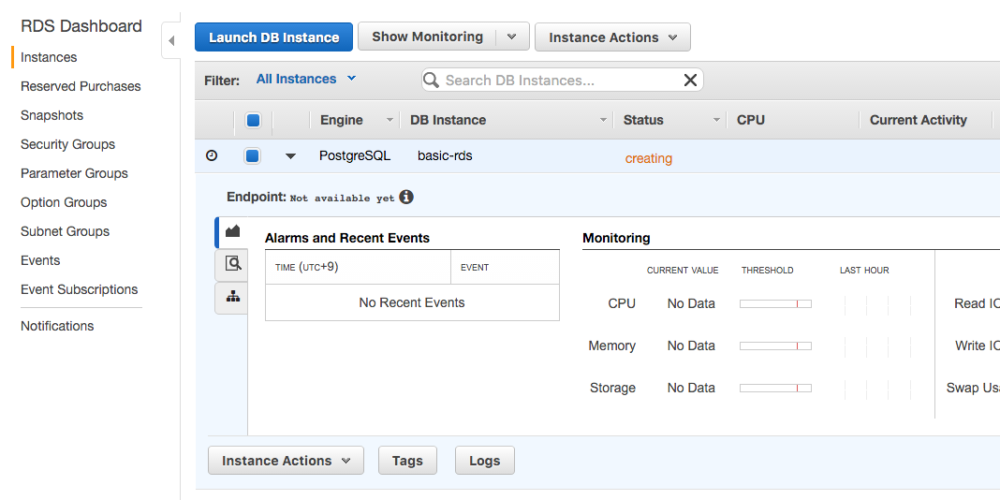

# RDSの作成

RDSを作成する。RDBMSはPostgreSQLを選択する。

# RDS Dashboardより作成開始

RDS Dashboard > Instances から、
"Launch DB Instance"ボタンを押す

"PostgreSQL"を選択して"Select"ボタンを押す

## Production | Dev/Testの選択

Production向けか、Dev/Test向けか問われる。
今回はProduction向けを選択しよう。

## Setting

...といいつつも今回はケチケチ運用で、

- MZなし
- SSDもGeneral Purpose
- t2.microで運用

みたいな感じにしていく。

## Advanced Settings

Security Groupなどの設定。
については今まで作成しておいた
Security GroupやVPCを選択する。

"Launch DB Instance"ボタンを押せばRDS作成は終わる。

以上で作成完了。

RDSインスタンスが立ち上がるのを待とう。

# 終わり

しばらく待てば、RDSインスタンスが立ち上がる。
以上でRDSの作成は完了。

