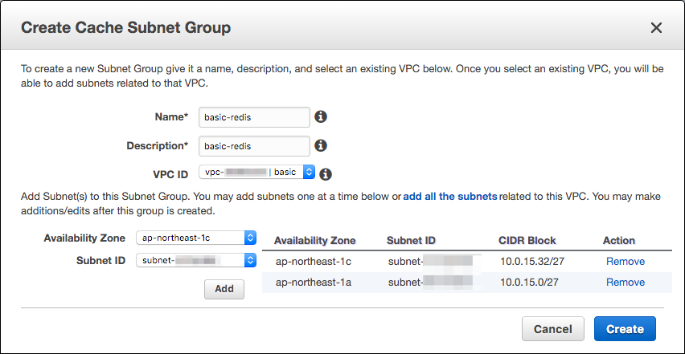

# ElastiCacheの作成

ElastiCacheの作成を行う。

# Cache Subnet Groupの作成

ElastiCache向けのSubnet Groupを別途作成する必要がある。
ElastiCache Dashboardより "Cache Subnet Groups"を選択し、
"Create Cache Subnet Group"ボタンを押す。

"basic" VPCを選択する

Availabilty ZoneのSubnetを割り当てていく

ap-northeast-1aとap-northeast-1cそれぞれに
"basic-redis"向けのSubnetを選択する。
SubnetIDでしか出てこないのでVPCでのSubnet一覧で確認しながら設定していく。

作り終えたら早速ElastiCacheの作成にとりかかる。

# RedisのElastiCacheインスタンスを立てる

RedisのElastiCacheインスタンスを立てる。
Redisを選択し、"Next"ボタンを押す。

## キャッシュクラスタの設定

Replication Group Nameは"basic-redis"など設定していく。
Security Groupは先程作成しておいた"basic-redis"を選択しよう。
Read Replicaの数は2台にしておく。
S3のバックアップはしないようにする。必要になったらあとでするようにしよう。
Backupについては省く。

内容に問題がなければ、"Launch Replication Group"ボタンを押す。
問題がなければ"Next"ボタンを押す。

無事Cache Clusterが作成されればOK。

これでElastiCacheの作成は終了
