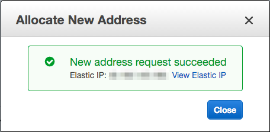

# 踏み台サーバの作成

踏み台用サーバのEC2インスタンスを作成する。


# インスタンスの設定など

ずらずらっとリストに並べておく。
Web用のEC2インスタンスとの違いは、
SubnetとSecurity Groupの設定。

- Subnet


- Security Group


立ち上げ時に、"basic-ec2-jump-hosts"は世界に公開されてるよ？
と警告が表示されるが、そのために使うので立ち上げる。

# EIPの割当

今のままだとインターネット回線を経由して
踏み台サーバへはアクセスできない。
EIPを割り当てて、インターネットからのアクセスを可能にする。


すでに設定されているEIPは以前作成した
Managed NAT Gatewayのものだ。
EIPについて知りたいかたは以下の文書を参考のこと

- [Elastic IP アドレス](http://docs.aws.amazon.com/ja_jp/AWSEC2/latest/UserGuide/elastic-ip-addresses-eip.html)

"Allocate New Address"ボタンを押して、EIPを作成、インスタンスに割り当てる。




# インスタンスの割当

作成したEIPを選択し、"Associate Address"項目を選択する。


"Instance"に踏み台サーバを選択する


# 踏み台サーバへのアクセス

割当を行ったEIPに対してSSH経由でログインを行う

```
> ssh ubuntu@{踏み台サーバのEIP}
```

ログインが行えれば成功

# 踏み台サーバからWebサーバへのログイン

についてもついでに行う。
ForwardAgentを有効にした状態で
踏み台サーバにログインを行う。

```
> ssh -A ubuntu@{踏み台サーバのEIP}
> ssh ubuntu@{Webサーバとして登録されているサーバのPrivate IPアドレス}
```

以上で踏み台サーバの構築は終わり

# SSHのポートについて

Security Groupでは22ポートを利用するようにしているが、
22ポートはBotからのログイン試行攻撃を普通に食らうので、
2022とか2222など他のポートを利用するようにしておくことをおすすめする
