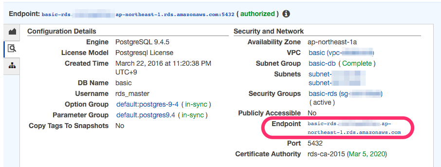
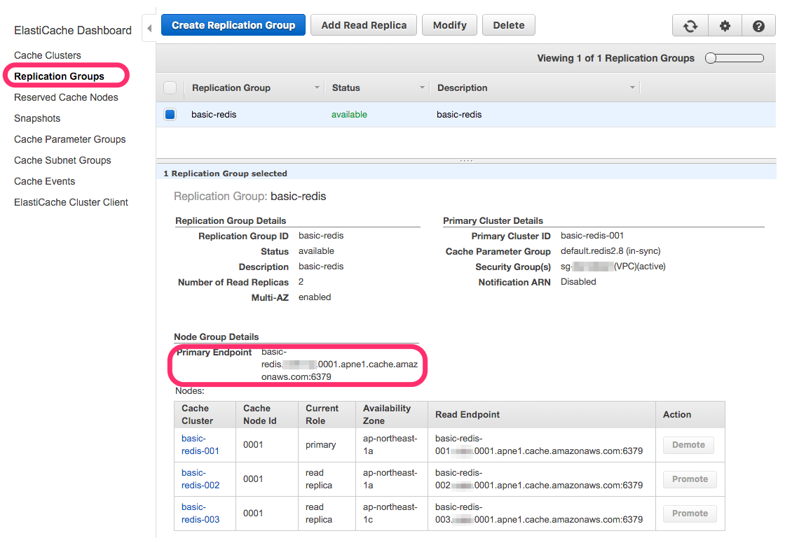

# EC2インスタンスからRDS/ElastiCacheへの疎通確認

EC2インスタンス(web用)からRDS、ElastiCacheへの疎通を確認していく。

# 疎通確認

## RDS

- PostgreSQL clientをインストールする

```
> sudo apt-get update
> sudo apt-get install postgresql-client
```

- RDSインスタンスのエンドポイントを確認する



- psqlコマンドにてRDSに接続する

```
ubuntu@ec2-web-01:~$ psql -h basic-rds.************.ap-northeast-1.rds.amazonaws.com -U rds_master basic
Password for user rds_master:
psql (9.3.11, server 9.4.5)
WARNING: psql major version 9.3, server major version 9.4.
         Some psql features might not work.
SSL connection (cipher: ECDHE-RSA-AES256-GCM-SHA384, bits: 256)
Type "help" for help.

basic=>
```

接続が行えた。問題ないようだ。

## ElastiCache(Redis)

- Redis clientをインストールする

```
> sudo apt-get install redis-tools
```

- ElastiCacheのエンドポイントを確認する

Replication GroupのPrimary Endpointを指定しよう。



- redic-cliを利用し接続

```
ubuntu@ec2-web-01:~$ redis-cli -h basic-redis.**********.ng.0001.apne1.cache.amazonaws.com
basic-redis.**********.ng.0001.apne1.cache.amazonaws.com:6379> INFO
# Server
redis_version:2.8.24
redis_git_sha1:0
redis_git_dirty:0
redis_build_id:0
redis_mode:standalone
os:Amazon ElastiCache
arch_bits:64
multiplexing_api:epoll
gcc_version:0.0.0
process_id:1
...
```

以上で疎通確認は終了。
